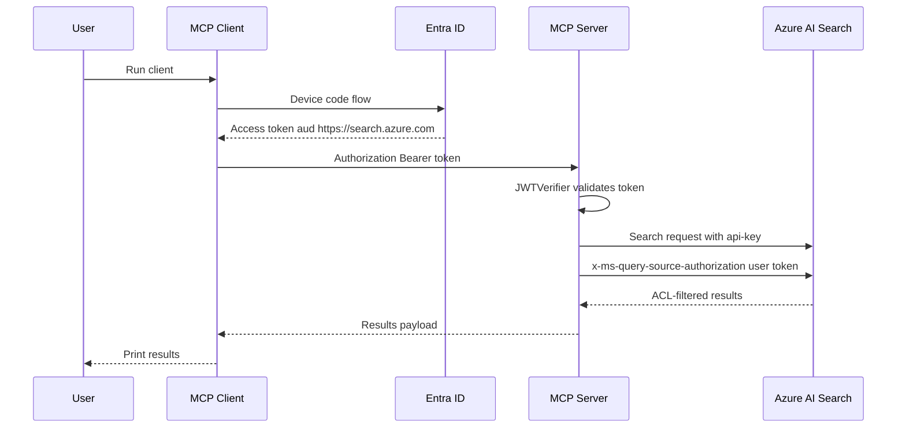

# MCP Server and Client

This folder contains a FastMCP HTTP server and a device-code client that query Azure AI Search with ACL filtering.

## Flow

## Quick start

1. Ensure root `.env` has `SEARCH_ENDPOINT` and `API_KEY`.
2. Start server: `uv run mcp/server.py`
3. Run client: `uv run mcp/client.py`

## App registration requirements

Use a single Entra ID app registration that supports device code and Azure AI Search delegated access.

- Public client flow enabled
- API permissions include Azure AI Search delegated permission: `user_impersonation`
- Admin consent granted for the permission
- Client app uses scope `https://search.azure.com/.default`
